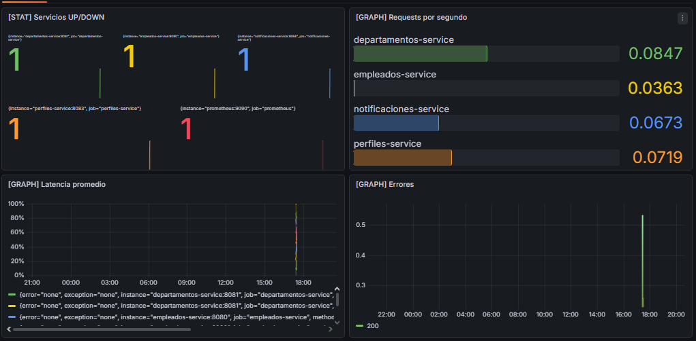
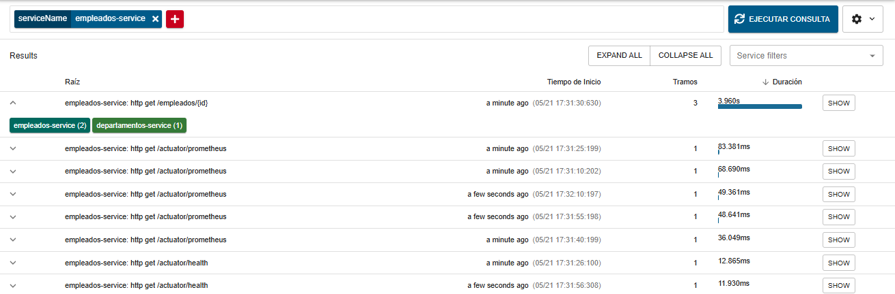
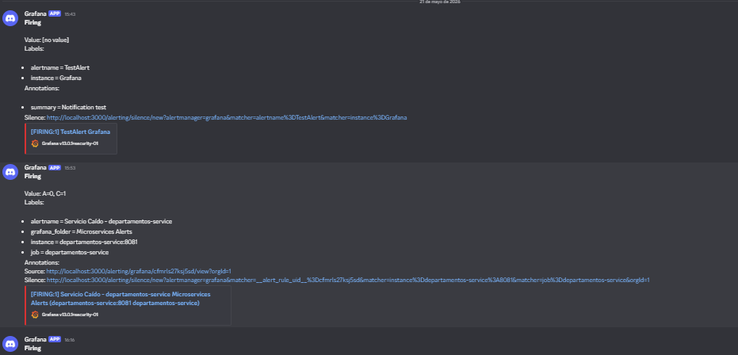
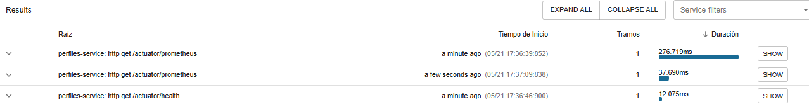
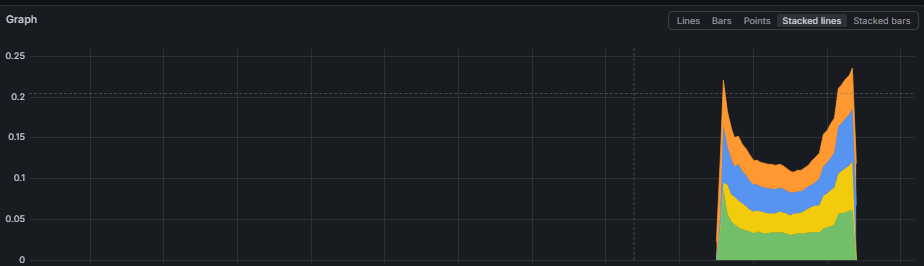

# 🧩 Sistema de Gestión de Empleados y Departamentos

Este proyecto implementa una arquitectura de microservicios usando Spring Boot y Docker Compose.

---

## 🚀 Tecnologías usadas

- Java 17
- Spring Boot
- MongoDB
- Docker & Docker Compose
- Swagger (OpenAPI)

---

## 🏗️ Arquitectura

El sistema está compuesto por:

- empleados-service (Puerto 8080)
- departamentos-service (Puerto 8081)
- Base de datos MongoDB para cada servicio

Los servicios se comunican entre sí mediante HTTP REST usando la red interna de Docker.

---

## ⚙️ Ejecución del sistema

Para levantar todo el sistema ejecutar:

```bash
docker compose up --build
```

---

## 📊 Pruebas de Observabilidad

### Dashboard de métricas en Grafana

> 

### Trazas distribuidas en Zipkin



### Alerta recibida en canal de notificación



---

### Análisis de rendimiento

**¿Qué servicio del ecosistema tardó más en responder y cómo lo identificaron?**


El servicio que tardó más en responder fue el `perfiles-service`, identificado a través de las métricas de latencia en Grafana y las trazas en Zipkin.